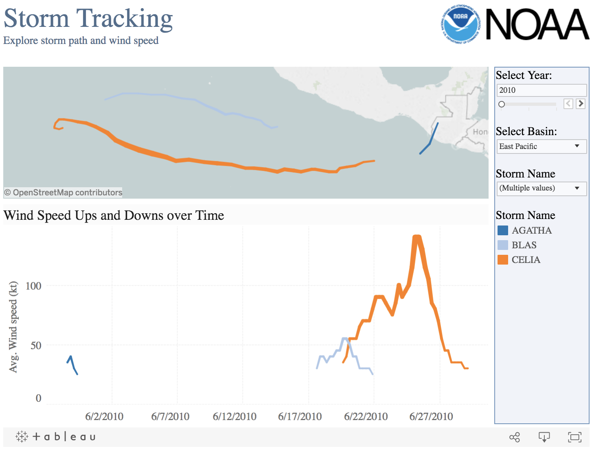

# vue-tableau
Vue.js component for integrating the [Tableau API](https://onlinehelp.tableau.com/current/api/js_api/en-us/JavaScriptAPI/js_api_ref.htm).

## Installation
```
yarn add vue-tableau
```

## Basic Usage

### main.js
Import vue-tableau within your javascript entry point.
``` javascript
import 'vue-tableau'
```
Now you are free to use the component wherever.

The following is a simple example:
``` html
<Tableau 
    :url="url" 
    :height="1000" 
    :width="1000" 
    :filters="{
        'Storm Name': ['CELIA', 'BLAS', 'AGATHA'],
        'Basin': 'East Pacific'
    }" 
    ref="tableau">
</Tableau>
```



### Documentation
The following props can be passed in and are automatically handled by the Tableau component:
- url
- height 
- width
- filters
- options (can specify constructor options explicity as documented [here](https://onlinehelp.tableau.com/current/api/js_api/en-us/JavaScriptAPI/js_api_ref.htm#ref_head_9)

The following classes along with all of their methods are accessible through vue refs:

- viz
- workBook
- workSheet

Example:
``` javascript
this.$refs['tableau'].workBook.getName() 
```

Please refer to the [Tableau API Documentation](https://onlinehelp.tableau.com/current/api/js_api/en-us/JavaScriptAPI/js_api_ref.htm) for more details regarding all the methods available.

